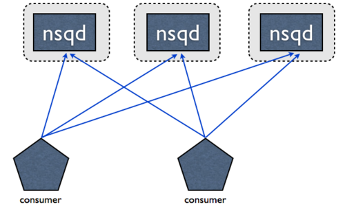
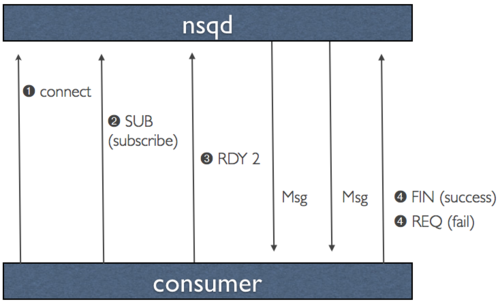

NSQ的[官方描述文档](http://nsq.io/overview/features_and_guarantees.html)中明确的声明了NSQ的几个特性：

## 1. 消息默认是不持久化的
nsq主要还是一个内存存储的消息队列，本身消息的缓冲区是在内存中的，只有超过一定的值之后才会持久化硬盘。如果希望每一条消息都持久化，可以通过--mem-queue-size=0参数来实现。

## 2. 没有内置的副本机制（built in replication）
如果想要保证HA，需要使用者自己考虑部署的拓扑结构，可以采用的技术方式没有限制，比如设置一个slave节点，或者把mem-queue-size设置为0保证消息不丢失等。

不要把支持集群与副本机制混为一谈，集群里的每个机器之间不一定是有主备关系的。

## 3. 消息的送达保证语义是至少送达一次（at least once），但前提是nsqd没有宕机

这里要两点要注意：

- 消费者要保证执行的逻辑是幂等的。 
- 这个与上面第二点有关，因为没有内置的备份机制，所以如果使用者既没有设计合理的拓扑结构保证nsqd的高可用性，又没有设置把所有的消息保存到硬盘上，那么万一nsqd挂了，那就是真悲剧了，消息会丢。

## 4. 消息的送达是没有时序保证的
因为nsqd之间是没有消息共享的，所以想保证集群全局范围内的时序性是不可能的。但是有一个很简单的策略可以给其加上一个弱时序的约束（虽然不能保证全局时序，但是能保证此消费者接受的时序）：

```
在消费者处理消息前，先经过一个『时延窗口』的排序，在这个窗口里对接收到的消息进行一个排序，然后再按
顺序交给消费者处理。当然，对于在时间窗口外的消息，是要做丢弃处理的。
```

## 4. nsqd之间是没有任何通信的，他们之间不共享数据


## 整理
- nsq说自己避免的单点故障，我认为指的是单点出问题了之后，后续整体业务功能不受影响，但是对之前的业务（尤其是出问题的单点上的丢失的消息）还是会有一定的影响的。所以一定要靠自己做好HA拓扑，比如官网上就很明确的有[这样一段描述](http://nsq.io/overview/design.html)：

```
Message Delivery Guarantees

NSQ guarantees that a message will be delivered at least once, though duplicate 
messages are possible. Consumers should expect this and de-dupe or perform 
idempotent operations.

This ensures that the only edge case that would result in message loss is an 
unclean shutdown of an nsqd process. In that case, any messages that were in 
memory (or any buffered writes not flushed to disk) would be lost.

If preventing message loss is of the utmost importance, even this edge case can be 
mitigated. One solution is to stand up redundant nsqd pairs (on separate hosts) 
that receive copies of the same portion of messages. Because you’ve written your 
consumers to be idempotent, doing double-time on these messages has no downstream 
impact and allows the system to endure any single node failure without losing 
messages
```

也就是充分利用cosuner幂等操作的特性，做一个冗余的nsqd，每条消息都处理两遍，虽然有点费事，但是对于不允许数据丢失的场合，这样的冗余还是可以接受的。



## 其他问题

- nsq的消息是被推送到消费者？还是由消费者自己去轮询（kafka的策略）？
	
	[引用一段官网上话](http://nsq.io/overview/design.html#efficiency)：
>For the data protocol, we made a key design decision that maximizes performance and throughput by pushing data to the client instead of waiting for it to pull. This concept, which we call RDY state, is essentially a form of client-side flow.
>
>When a client connects to nsqd and subscribes to a channel it is placed in a RDY state of 0. This means that no messages will be sent to the client. When a client is ready to receive messages it sends a command that updates its RDY state to some # it is prepared to handle, say 100. Without any additional commands, 100 messages will be pushed to the client as they are available (each time decrementing the server-side RDY count for that client).

	
	
	
	1. consumer通过某种方式（nsqlookupd查询，或者直接配置nsqd地址）获取到nsqd地址后，通过tcp连接上
	2. consumer向nsqd上报自己订阅的topic
	3. consumer
	4. 接受消息
	5. 返回处理的结果是成功还是失败
	
	首先明确一个前提，就是一个consumer可以同时连接多个producer（甚至说所有的producer）。producer只会向已经更行了RDY状态大于0的consumer发送消息，所以果从这个角度来看，nsq中的消息是被推送到consumer的。但是，consumer在汇报ready状态的时候，是轮询每一个nsqd的。
